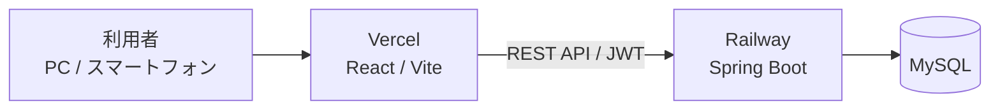
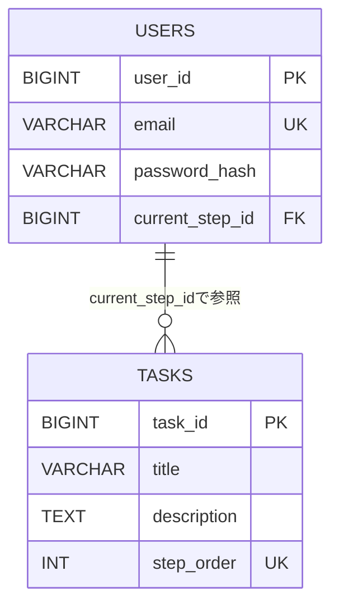

# つぎなに？ ～開発初心者向け学習タスクアプリ～

> **迷わず進める1ステップ集中型タスクナビ**

「次に何をすればいいか分からない」という開発初心者の悩みを解決するための、学習タスクナビゲーションWebアプリ。1回に取り組むタスクを１つに絞り、「完了して次へ」を押しながら開発の流れを順番に進めるようした。

---

## 🌐 アプリケーションURL

https://tsugi-nani-app.vercel.app

\*テスト⽤アカウント（ID：user2@example.com/パスワード：12345abcde）は、
新規登録画面確認する際は、適当にID/パスワードを登録することも可能。

**GitHub**
https://github.com/knkgw277-arch/TsugiNani-app

---

## 📱 アプリケーションの概要

Webアプリ開発を始めたばかりの初心者を対象とする。
Webアプリ開発では、

- 「次に何をすればいいのか分からない」
- 「やることが多くて、どこから手をつければいいか迷う」
- 「途中で止まってしまい、再開するときに何をすればいいか分からない」
  といった問題が起こりやすいと考え、「今やること」を１つだけ表示し、完了したら次のタスクへ進む仕組みにした。

---

## 💡 開発した背景

Webアプリ開発を学習していると、実装・データベース・API・画面作成など、やるべきことがどんどん増えていく。
特に開発初心者にとっては、「作るものは決まっているけれど、次に何をすればいいのか分からない」という状態になりやすいと感じ、

> **「次にやることを考える時間を減らし、ひとつの作業に集中できるようにする」**

ことを目的として、このアプリを制作。

### 設計で意識したこと

最初から多くの機能を追加するのではなく、まずは「現在のタスクを確認して、完了したら次へ進む」という最小限の流れを中心に設計。また、ログアウトして再度ログインした場合でも前回の進捗から再開できるようにし、学習を途中で中断しても続きから取り組めるようにした。

---

## ✨ 主な機能

機能 内容

---

新規会員登録 メールアドレスとパスワードでアカウントを作成
ログイン 登録済みアカウントでログイン
タスク表示 現在取り組むべきタスクを1件表示
進捗表示 現在のステップと全体の進捗を表示
次のタスクへ タスクを完了し、次のステップへ進む
進捗保存 現在のステップをデータベースへ保存
進捗復元 再ログイン後に前回の進捗から再開
ログアウト アクセストークンを削除してログイン画面へ戻る
完了画面 すべてのタスク完了時に表示
リセット 最初のタスクからやり直す

---

## 🖥️ アプリケーションのデモ

文字だけでは伝わりにくいUIや操作感を、スクリーンショットで紹介します。

### ログイン画面


### 会員登録画面


### メイン画面


### 完了画面


---

## 🔄 アプリの利用フロー

```text
新規会員登録
      ↓
    ログイン
      ↓
最初のタスクを表示
      ↓
「完了して次へ」
      ↓
次のタスクへ
      ↓
進捗をデータベースへ保存
      ↓
ログアウト
      ↓
    再ログイン
      ↓
前回の進捗から再開
      ↓
すべてのタスクを完了
      ↓
Complete画面
      ↓
「最初からやり直す」
      ↓
最初のタスクへ
```

---

## 🛠️ 主な使用技術

### フロントエンド

- React
- Vite
- JavaScript
- Axios
- React Router

### バックエンド

- Java
- Spring Boot
- Spring Security
- JWT

### データベース

- MySQL

### 開発・管理

- IntelliJ IDEA
- VS Code
- Docker / Docker Compose
- Postman
- GitHub / GitHub Desktop

### デプロイ

- Vercel：フロントエンド
- Railway：バックエンド・MySQL

---

## 🏗️ システム構成



---

## 🗄️ ER図



### データ設計のポイント

- `users.email` は一意に設定
- パスワードはハッシュ化して保存
- `current_step_id` で現在取り組むタスクを管理
- `step_order` によってタスクの順番を管理
- 順送り方式のため、現在のステップより前のタスクは完了済みとして扱う
- すべてのタスク完了時は `current_step_id` を `NULL` とする
- リセット時は先頭タスクのIDへ戻す

---

## 🔐 認証・セキュリティ

ログイン時にバックエンドからJWTアクセストークンを発行し、以降のAPI通信で利用。
フロントエンドではアクセストークンを保存し、APIリクエスト時にAuthorizationヘッダーへ付与。
また、パスワードは平文では保存せず、ハッシュ化してデータベースへ保存。

---

## 🔌 主なAPI

HTTPメソッド エンドポイント 内容

---

POST `/api/auth/register` 新規会員登録
POST `/api/auth/login` ログイン
GET `/api/progress/me` 現在の進捗を取得
GET `/api/tasks` タスク一覧を取得
POST `/api/progress/next` 次のタスクへ進む
POST `/api/progress/reset` 進捗を最初に戻す

---

## 📁 プロジェクト構成

```text
TsugiNani-app/
├── backend/
│   └── src/
│       └── main/
│           ├── java/
│           │   └── com.tsuginani.backend/
│           │       ├── config/
│           │       ├── controller/
│           │       ├── dto/
│           │       ├── entity/
│           │       ├── exception/
│           │       ├── repository/
│           │       ├── security/
│           │       └── service/
│           └── resources/
│
├── frontend/
│   ├── public/
│   └── src/
│       ├── api/
│       ├── components/
│       ├── pages/
│       ├── App.jsx
│       ├── index.css
│       └── main.jsx
│
└── docker-compose.yml
```

---

## 🚀 ローカル環境での起動方法

### 1. リポジトリをクローン

```bash
git clone https://github.com/knkgw277-arch/TsugiNani-app.git
cd TsugiNani-app
```

### 2. Dockerを起動

プロジェクトルートで以下を実行。

```bash
docker compose up -d
```

### 3. バックエンドを起動

`backend` をSpring Bootアプリケーションとして起動。

### 4. フロントエンドを起動

```bash
cd frontend
npm install
npm run dev
```

ブラウザからViteの開発サーバーへアクセス。

```text
http://localhost:5173
```

> ローカル環境のデータベース接続情報や環境変数を使用する場合は、各自の開発環境に合わせて設定。

---

## ✅ 動作確認

以下の主要なMVP機能について動作確認を行っている。

- [x] 新規会員登録
- [x] ログイン
- [x] 最初のタスクが表示される
- [x] 「完了して次へ」
- [x] 次のタスクへ進む
- [x] ログアウト
- [x] 再ログイン
- [x] 前回の進捗が復元される
- [x] 最後のタスクを完了
- [x] Complete画面が表示される
- [x] 「最初からやり直す」
- [x] 最初のタスクに戻る

---

## 🎨 UI・UXで意識したこと

初心者が「次に何をすればいいのか」で迷わないことを重視し、1画面に表示する情報を整理した。

- 現在のステップを分かりやすく表示
- 進捗をバーで視覚化
- メインとなる操作を「完了して次へ」に集約
- ログイン・会員登録・Complete画面でデザインを統一
- PCだけでなくスマートフォンでも利用しやすいレスポンシブデザインを採用

---

## 🔧 工夫した点・苦労した点

### 1. 進捗をデータベースに保存

画面上だけで次のタスクへ進めるのではなく、ユーザーの現在ステップをデータベースに保存することで、ログアウト後も続きから再開できるようにした。

### 2. JWTによる認証

ログイン後に発行したJWTを利用して、ユーザーごとのAPIアクセスを管理。

### 3. フロントエンドとバックエンドの分離

ReactとSpring Bootを分離し、REST APIを介して通信する構成。画面側とAPI・データベース側の役割を分ける設計。

### 4. MVPに機能を絞った設計

最初から多機能にするのではなく、「現在のタスクを確認 → 完了 →　次へ進む」というアプリの中心的な価値に必要な機能を優先。

---

## 📌 今後改善したいこと

現時点では「次にやることをひとつに絞って提示する」という基本機能を完成。今後は以下のような機能を追加すると、さらに学習を継続しやすいアプリへ発展させられると考えている。

- タスクごとの学習メモ
- タスク完了履歴
- 学習進捗の可視化
- タスク内容の追加・編集
- 学習期間や目標の設定
- より詳しいタスク解説
